# Project Diagrams - Fraud Detection GNN System

This document contains all architectural and workflow diagrams for the Fraud Detection System using Graph Neural Networks.

---

## 1. Project Structure

```
GNN-project/
│
├── api/                          # FastAPI REST API
│   ├── app.py                   # Main API application
│   └── inference.py             # Inference service
│
├── feature_engineering/         # Feature extraction
│   ├── feature_extractor.py     # Node feature extraction (50 features)
│   └── graph_embeddings.py      # Graph embedding generation
│
├── gnn_training/                # Model training
│   ├── gnn_model.py             # GNN model architecture
│   └── distributed_trainer.py  # Distributed training logic
│
├── graph_processing/            # Graph construction
│   ├── graph_builder.py         # Build graph from transactions
│   └── graph_partitioner.py     # Graph partitioning for distributed processing
│
├── storage/                      # Feature storage backends
│   ├── storage_backend.py       # Abstract storage interface
│   ├── feature_store.py         # Feature store implementation
│   └── datagen.py               # Data generation utilities
│
├── scripts/                      # Utility scripts
│   ├── init_postgres.sql        # PostgreSQL schema
│   ├── init_neo4j.cypher        # Neo4j graph structure
│   ├── extract_all_features.py  # Feature extraction pipeline
│   └── test_*.py                 # Connection test scripts
│
├── data/                         # Data storage
│   └── features/                # Extracted features (Parquet)
│
├── config.yaml                   # Configuration file
├── main.py                       # Main orchestration script
├── docker-compose.yml           # Docker services definition
└── requirements.txt             # Python dependencies
```

---

## 2. System Architecture Diagram

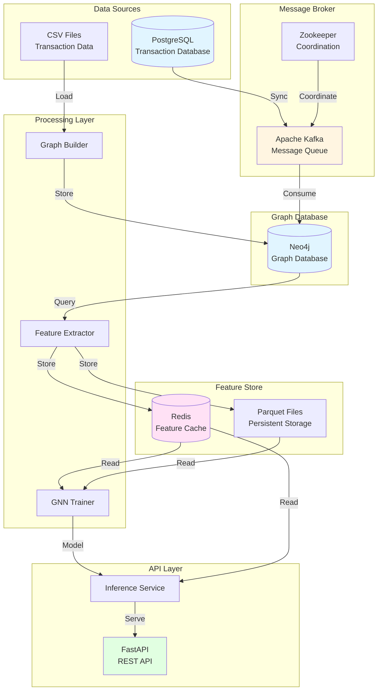

---

## 3. Data Flow Diagram

```mermaid
flowchart LR
    subgraph "Phase 1: Data Ingestion"
        A[Transaction Data<br/>PostgreSQL/CSV] -->|Batch/CDC| B[Kafka Topic<br/>transactions-raw]
        B -->|Consume| C[Neo4j Loader]
        C -->|Create Graph| D[Neo4j Graph<br/>Nodes & Edges]
    end

    subgraph "Phase 2: Feature Extraction"
        D -->|Query Subgraph| E[Feature Extraction<br/>Workers]
        E -->|Extract 50 Node<br/>+ 12 Edge Features| F[Kafka Topic<br/>features-computed]
        F -->|Aggregate| G[Feature Aggregator]
        G -->|Store| H[Redis Feature Store]
        G -->|Backup| I[Parquet Files]
    end

    subgraph "Phase 3: Model Training"
        H -->|Load Features| J[GNN Trainer<br/>Distributed]
        I -->|Load Features| J
        J -->|Train Model| K[Trained Model<br/>model.pth]
    end

    subgraph "Phase 4: Inference"
        L[API Request] -->|Query| H
        H -->|Get Features| M[Inference Service]
        K -->|Load Model| M
        M -->|Predict| N[Fraud Score<br/>Response]
    end

    style A fill:#e1f5ff
    style D fill:#e1f5ff
    style H fill:#ffe1f5
    style K fill:#e1ffe1
    style N fill:#ffe1f5
```

---

## 4. User Workflow Diagram

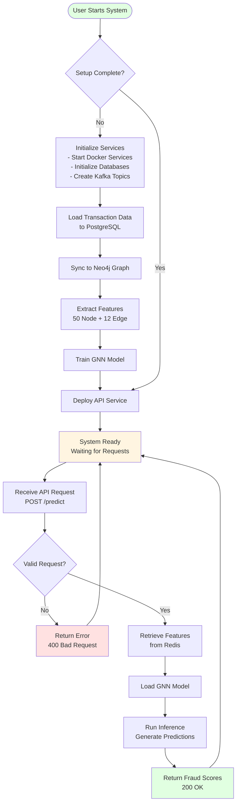

---

## 5. Component Interaction Diagram

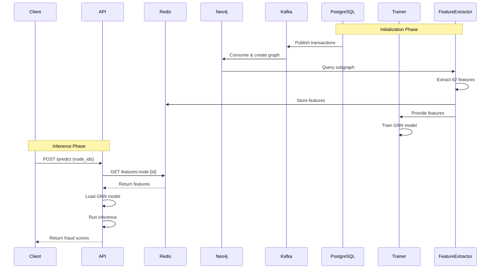

---

## 6. Deployment Architecture

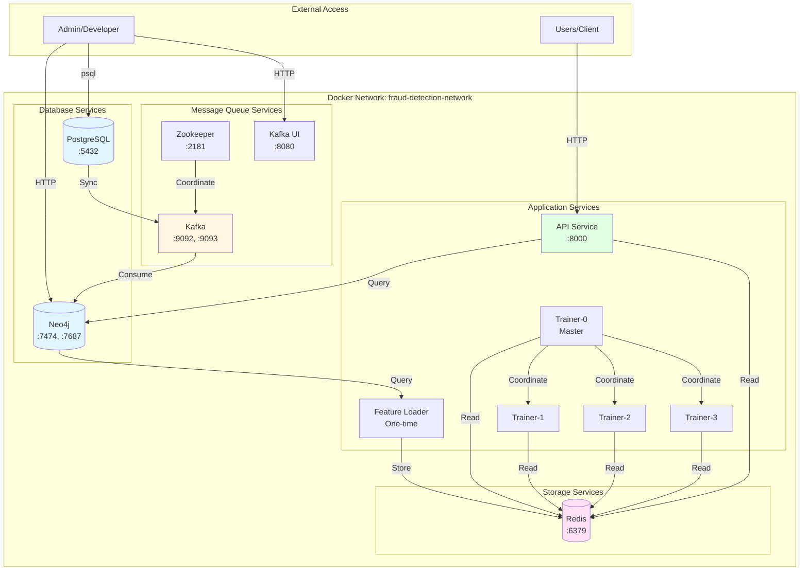

---

## 7. Feature Extraction Pipeline

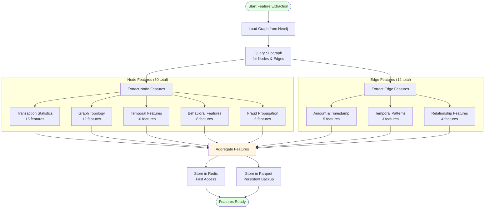

---

## 8. Training Pipeline Flow

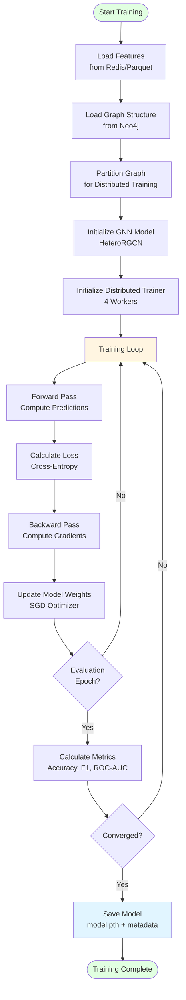

---

## 9. Kafka Message Flow

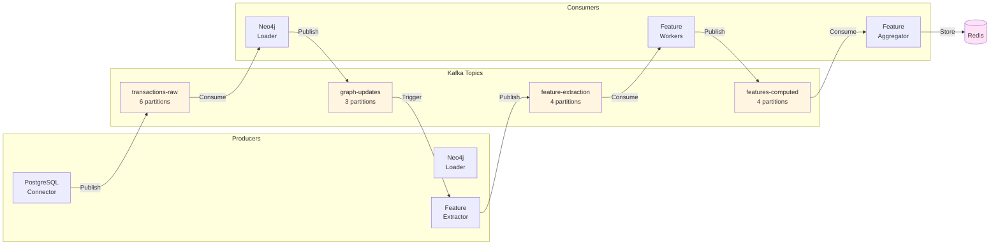

---

## 10. Graph Structure Diagram

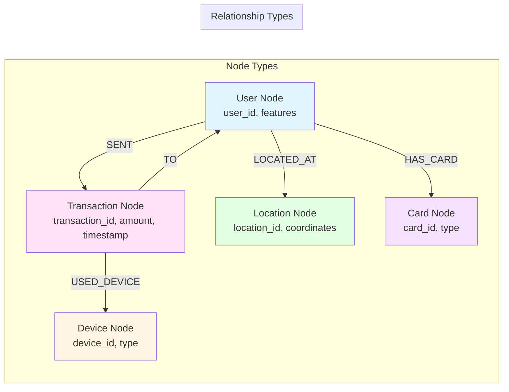

---

## 11. API Endpoint Flow

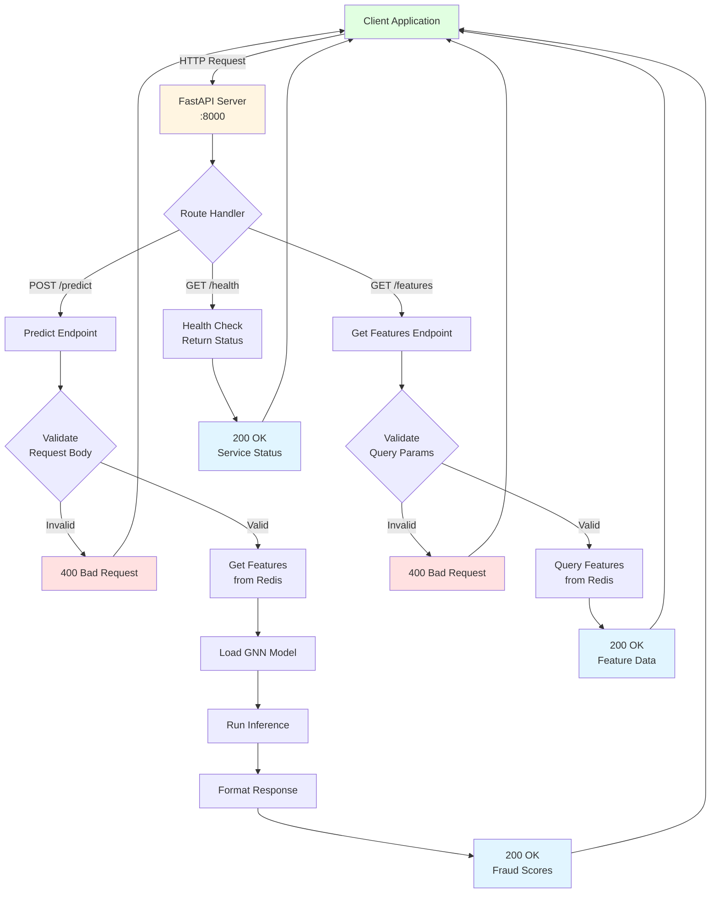

---

## 12. Distributed Training Architecture

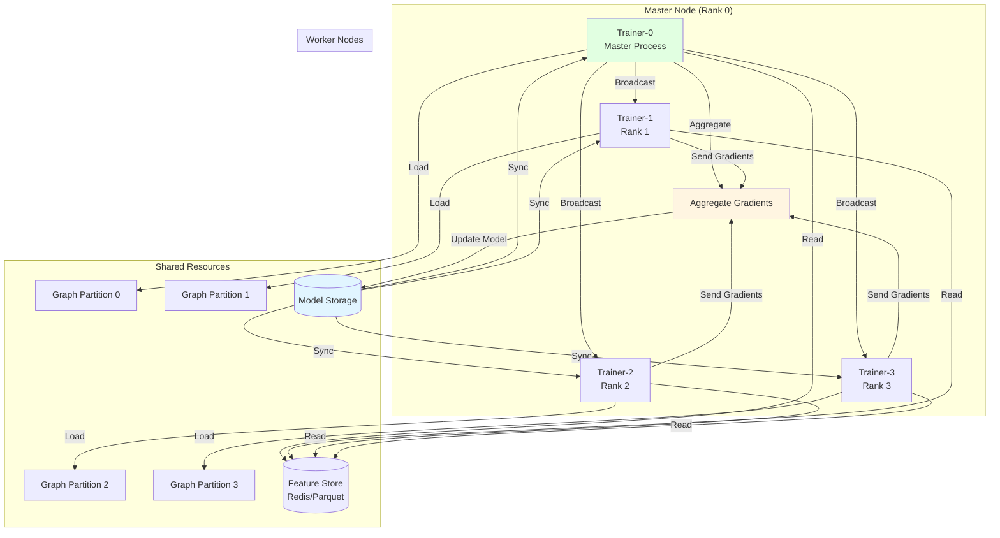

---

## Diagram Usage Notes

### For Reports:
- **Mermaid diagrams** render in most modern markdown viewers (GitHub, GitLab, VS Code, etc.)
- For presentations, you can:
  1. Use online Mermaid editors (mermaid.live) to export as PNG/SVG
  2. Use tools like `mermaid-cli` to convert to images
  3. Copy ASCII diagrams directly into documents

### Diagram Types:
1. **Project Structure** - Shows code organization
2. **System Architecture** - High-level component overview
3. **Data Flow** - How data moves through the system
4. **User Workflow** - End-to-end user journey
5. **Component Interaction** - Sequence of operations
6. **Deployment Architecture** - Docker container layout
7. **Feature Extraction Pipeline** - Feature computation flow
8. **Training Pipeline** - Model training process
9. **Kafka Message Flow** - Message queue architecture
10. **Graph Structure** - Neo4j graph schema
11. **API Endpoint Flow** - Request/response handling
12. **Distributed Training** - Multi-worker training setup

---

*Last Updated: 2024*

